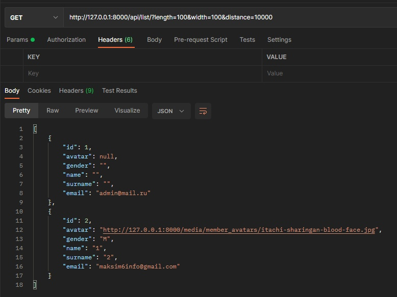
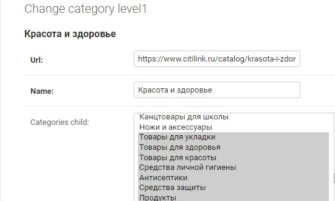

# Тестовое задание APPTRIX

## Примечания

1) Для работы 4-го пункта (отправки сообщения участникам), необходимо в файле settings.py добавить почту, с которой будут отправляться сообщения.  

2) Для 6-го пункта (определение дистанции между участниками), реализовано api по следующему принципу:
    
    /api/list/?length={долгота}&width={широта}&distance={заданная_дистанция}

    Пример: 

3) Для 7-го пункта (парсинг товаров), парсинг категорий происходит по следующему api:
   /api/products/parse/categories/, где у главной категории сохраняются все ее подкатегории:

   Для парсинга товаров определенной категории нужно обращаться к следующему api, где перед этим нужно обратиться к api для сохранения категорий в бд (/api/products/parse/categories/):

   /api/products/parse/category/{slug}/

   где slug-ом является часть url-а с самого citilink:

   *Все товары сохраняются в бд с привязанными категориями.*

   *Также, у некоторых подкатегорий есть еще подкатегории, поэтому некоторые товары сохраняются без категорий.*
   *И эти под-подкатегории не сохраняются в базу данных.* 

## Стек используемых технологий

1) python3
2) Django
3) djangorestframework
4) beautifulsoup4 
5) django-filter